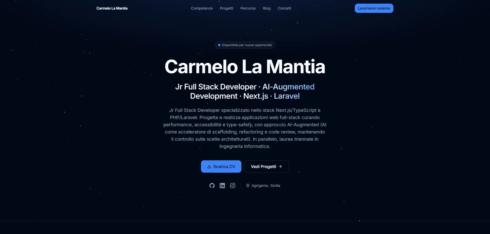

<div align="center">

# 🚀 Carmelo La Mantia — Portfolio

**Jr Full Stack Developer** · Agrigento, Sicilia

Portfolio personale costruito in **Next.js 14 · TypeScript strict · Tailwind CSS**

<br>

[](https://nextjs.org/)
[](https://react.dev/)
[](https://www.typescriptlang.org/)
[](https://tailwindcss.com/)
[](https://vitest.dev/)

[](https://github.com/MeloLM/My_Portfolio/actions/workflows/ci.yml)
[](LICENSE)

<br>

[**🌐 Sito**](https://my-profile-ten-beta.vercel.app) · [**💼 LinkedIn**](https://www.linkedin.com/in/carmelo-la-mantia-web-developer/) · [**✉️ Email**](mailto:carmelo.la.mantia00@gmail.com)

<br>



</div>

---

## 🎯 Cos'è

Portfolio personale in **Next.js 14 (App Router)** e **TypeScript strict**, con design dark nativo su Tailwind CSS e componenti in stile shadcn/ui.

La **V2** è una riscrittura completa, non un restyling. La versione precedente aveva un CSS monolitico da 1600 righe, componenti ibridi JS/TS e credenziali hardcodate nel sorgente. Questa versione parte da zero su tre principi:

> **Un solo posto per i contenuti** · **Server Component per default** · **Niente colori fuori dal design system**

---

## ✨ Caratteristiche

| | |
|---|---|
| 🧬 **Single source of truth** | Testi, skill, progetti e timeline vivono solo in [`profileData.ts`](src/data/profileData.ts). Cambiare un progetto aggiorna card, case study, sitemap e structured data insieme |
| ⚡ **Server-first** | Su tutto l'albero solo **5 file** sono Client Component. La landing è HTML statico al primo byte: **120 kB** di First Load JS |
| 🔐 **Zero credenziali nel codice** | Nessun fallback hardcodato. Se le variabili d'ambiente mancano, il form si disabilita e mostra l'email diretta invece di fingere di funzionare |
| ♿ **Accessibilità verificata** | Skip link, focus ring coerente, menu mobile con `aria-expanded` e chiusura da `Escape`, errori annunciati via `aria-describedby`, `prefers-reduced-motion` rispettato |
| 🧪 **108 test** | Vitest + Testing Library su data layer, hook, primitive UI e sezioni. La suite è validata con test di mutazione |
| 🎨 **Design token semantici** | I colori esistono una volta sola come canali HSL. Nessun valore esadecimale nel markup |
| 🌌 **Starfield su canvas** | Sfondo animato che si ferma da sé fuori dal viewport, a scheda inattiva e con `prefers-reduced-motion`. Costo: **+0.8 kB** |
| 📄 **SEO completa** | JSON-LD Person e WebSite, OG image 1200×630 generata a runtime, sitemap con tutte le rotte dinamiche |

---

## 🛠️ Stack

| Area | Scelta |
|------|--------|
| **Framework** | Next.js 14 App Router |
| **Linguaggio** | TypeScript 5, `strict: true` — zero `any`, zero file `.js` sotto `src/` |
| **Styling** | Tailwind CSS 3.4 + design token semantici |
| **Icone** | lucide-react · marchi social come SVG inline |
| **Contenuti** | `profileData.ts` + MDX per il blog |
| **Form** | EmailJS |
| **Test** | Vitest 4 + Testing Library |
| **CI** | GitHub Actions — lint → type-check → test → build |
| **Deploy** | Vercel (Git integration) |

---

## 🚀 Avvio rapido

Richiede **Node.js 18.17+** (la CI gira su Node 20).

```bash
git clone https://github.com/MeloLM/My_Portfolio.git
cd My_Portfolio
npm install
cp .env.example .env    # compila le variabili EmailJS
npm run dev
```

L'app parte su **http://localhost:3000**

---

## 🔐 Variabili d'ambiente

In Next.js solo il prefisso `NEXT_PUBLIC_` raggiunge il browser. Se le tre variabili mancano, il form di contatto si disabilita e mostra l'email diretta: **nel codice non esistono credenziali di fallback**.

```env
NEXT_PUBLIC_EMAILJS_SERVICE=service_your_id
NEXT_PUBLIC_EMAILJS_TEMPLATE=template_your_id
NEXT_PUBLIC_EMAILJS_KEY=your_public_key
```

> ⚠️ La public key EmailJS è visibile nel bundle per definizione. Attiva la restrizione per dominio dalla dashboard: **Account → Security**.

---

## 📜 Script

| Comando | Cosa fa |
|---------|---------|
| `npm run dev` | Server di sviluppo |
| `npm run build` | Build di produzione |
| `npm start` | Serve la build |
| `npm run lint` | ESLint |
| `npm run type-check` | `tsc --noEmit` |
| `npm run test` | Vitest in watch |
| `npm run test:run` | Vitest una sola volta |
| `npm run test:coverage` | Report di copertura |
| `npm run analyze` | Build con bundle analyzer |

---

## 🏗️ Architettura

```
src/
├── app/                        # App Router
│   ├── layout.tsx              # Font, metadata, JSON-LD
│   ├── page.tsx                # Landing page
│   ├── globals.css             # Direttive Tailwind + design token
│   ├── opengraph-image.tsx     # OG image 1200x630 generata da next/og
│   ├── blog/                   # Indice e articoli MDX
│   ├── projects/[slug]/        # Case study
│   ├── robots.ts               # robots.txt dinamico
│   └── sitemap.ts              # Sitemap con tutte le rotte dinamiche
│
├── components/
│   ├── layout/                 # SiteHeader, SiteFooter, PageShell
│   ├── sections/               # Hero, Skills, Projects, Timeline, Contact
│   └── ui/                     # Primitive: Button, Badge, Field, Starfield...
│
├── constants/                  # SITE_URL, navigazione, validazione, EmailJS
├── content/blog/               # Articoli in MDX
├── data/profileData.ts         # ⭐ Single source of truth
├── hooks/                      # useScroll, useEmail
├── lib/                        # Lettura MDX, helper cn()
└── __tests__/                  # 108 test su 7 file
```

**Regola di dipendenza:** `sections → ui`, mai il contrario. Le primitive non importano il data layer.

**Confine Server/Client:** un componente diventa client solo se ha stato, effetti o event handler, e va tenuto il più in basso possibile nell'albero. Oggi sono cinque: `SiteHeader`, `Contact`, `Starfield`, `useEmail` e `error.tsx`.

---

## 🎨 Design system

I colori sono definiti una sola volta in `globals.css` come canali HSL e mappati in `tailwind.config.ts` su nomi semantici. I componenti usano `bg-background`, `text-muted-foreground`, `border-border`.

| Token | Valore | Uso |
|-------|--------|-----|
| `background` | Slate 950 `#020617` | Sfondo pagina |
| `foreground` | Slate 50 `#f8fafc` | Testo principale |
| `primary` | Blue 500 `#3b82f6` | Accento, CTA, focus ring |
| `card` | Slate 900 | Superfici elevate |
| `muted-foreground` | Slate 400 | Testo secondario |

La composizione delle classi passa da `cn()` (`clsx` + `tailwind-merge`), così una prop `className` può sovrascrivere lo stile di base senza dipendere dall'ordine nel foglio generato.

---

## 🧪 Qualità

```bash
npx tsc --noEmit    # 0 errori
npx next lint       # 0 warning
npx vitest run      # 7 file, 108 test
npx next build      # 15 pagine generate a build time
```

I test non si limitano allo happy path. Il data layer verifica che ogni skill abbia un logo autentico **oppure** un fallback generico — mai il logo di un'altra tecnologia — e che ogni path di immagine esista davvero in `public/`.

Le suite sulle primitive UI sono state validate con **test di mutazione**: rompendo deliberatamente `cn()` e la convenzione degli id d'errore, sono caduti esattamente i test attesi e nessun altro.

---

## 📚 Documentazione

Questo repository documenta anche il proprio processo di sviluppo.

| File | Contenuto |
|------|-----------|
| [`ARCHITECTURE.md`](ARCHITECTURE.md) | Principi, flusso dei dati, confine Server/Client, design system, accessibilità |
| [`TODO.md`](TODO.md) | Debito tecnico della V1 con l'intervento che ha chiuso ogni voce, più il backlog aperto |
| [`ai_law_portfolio.md`](ai_law_portfolio.md) | Regolamento vincolante per gli agenti AI che operano sul repository: sicurezza zero-trust, qualità del codice, blocco commit, verifiche obbligatorie |
| [`log/`](log/) | Registro cronologico di ogni sessione di lavoro: ragionamento seguito, tentativi falliti, decisioni scartate e verifiche eseguite |

Il progetto è sviluppato con approccio **AI-Augmented**: l'AI come acceleratore di scaffolding, refactoring e code review, mantenendo il controllo sulle scelte architetturali. La cartella `log/` racconta come.

---

## 📄 Licenza

[MIT](LICENSE) — Carmelo La Mantia

<div align="center">
<br>
<sub>Se il progetto ti è stato utile, lascia una ⭐</sub>
</div>
